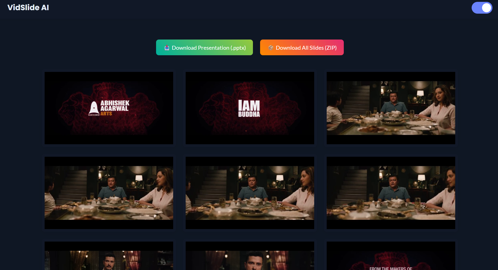

# 🎥 Video to Slides App 🔥

Have you ever wished you could instantly turn a video into a clean slide presentation?  
This project makes it possible! Upload a video, and the app automatically extracts key frames and generates a slide deck for you.  

This project is a simple **Flask-based web application** that helps automate the process of making slides from videos.  
It’s lightweight, fast, and beginner-friendly. 🚀  

---

## 📌 Built With
- Python (Flask, OpenCV)
- HTML5 + CSS3 (Frontend)
- Bootstrap (for responsive UI)

---

## 📌 Features
The app can do a lot of cool things, such as:  
- Upload videos directly from browser  
- Extract **key frames** from video automatically  
- Convert frames into a **slide-based presentation**  
- Download or preview generated slides  
- Clean and minimal user interface  

---
📌 Screenshots

## 📌 Requirements
- Python 3.8+  
- Flask  
- OpenCV  
- Werkzeug  

(All dependencies are included in `requirements.txt`)

📌 Contributing

Pull requests are welcome!
For major changes, please open an issue first to discuss what you would like to change.

👤 Author

saurabh kumar

GitHub: @saurabh9835

LinkedIn: www.linkedin.com/in/saurabh-kumar-180570341

📌 Show your support

⭐️ this repository if you like it and find it useful!
