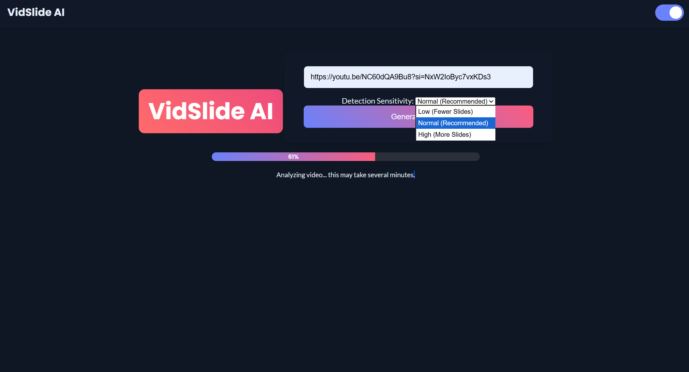
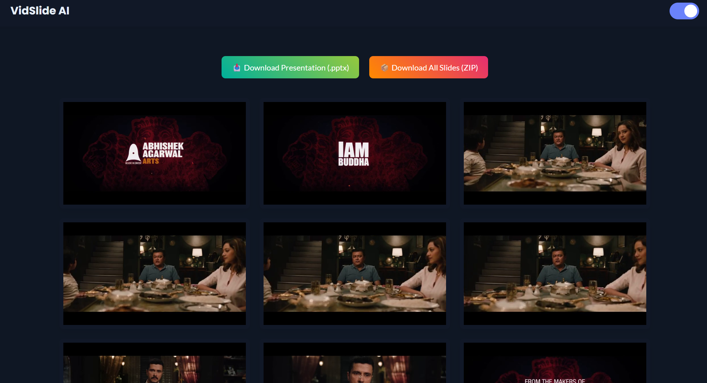

# 🎥 Video to Slides App 🔥

Have you ever wished you could instantly turn a video into a clean slide presentation?  
This project makes it possible! Upload a video, and the app automatically extracts key frames and generates a slide deck for you.  

This project is a simple **Flask-based web application** that helps automate the process of making slides from videos.  
It’s lightweight, fast, and beginner-friendly. 🚀  

---

## 📌 Built With
- Python (Flask, OpenCV)
- HTML5 + CSS3 (Frontend)
- Bootstrap (for responsive UI)

---

## 📌 Features
The app can do a lot of cool things, such as:  
- Upload videos directly from browser  
- Extract **key frames** from video automatically  
- Convert frames into a **slide-based presentation**  
- Download or preview generated slides  
- Clean and minimal user interface  

---
📌 Screenshots




## 📌 Requirements
- Python 3.8+  
- Flask  
- OpenCV  
- Werkzeug  

(All dependencies are included in `requirements.txt`)

## 🚀 Deployment
This app is ready for deployment on platforms that support Python WSGI apps.

### Heroku / Render / Railway
1. Push your repository to GitHub.
2. Make sure `requirements.txt` and `Procfile` are present.
3. Deploy using your chosen service and set these environment variables if desired:
   - `FLASK_APP_SECRET_KEY` — any secure secret string.
   - `SKIP_ML=1` if you want to skip TensorFlow/ResNet model loading in low-memory environments.

### Heroku / Railway
This app can also be deployed on Vercel and Render.

### Render
1. Push your repository to GitHub.
2. Create a new Render web service.
3. Connect your GitHub repo and select the branch to deploy.
4. Ensure `requirements.txt`, `Procfile`, and `render.yaml` are present in the repo root.
5. Set environment variables in Render dashboard:
   - `FLASK_APP_SECRET_KEY` — your secret key.
   - `SKIP_ML=1` — optional, use this if you want to skip TensorFlow/ResNet model loading in low-memory environments.
6. Render will install dependencies and run:
   `gunicorn app:app --workers 2 --threads 4 --timeout 300`

### Vercel
This app can also be deployed on Vercel as a Python WSGI app.

1. Push your repository to GitHub.
2. Confirm `vercel.json` and `.vercelignore` are in the project root.
3. In Vercel, create a new project and link your GitHub repo.
4. For production, set environment variables:
   - `FLASK_APP_SECRET_KEY`
   - `SKIP_ML=1` if you want to avoid heavy TensorFlow loading.

### Local deploy command
```bash
pip install -r requirements.txt
python app.py
```

### Notes
- The app uses `gunicorn` in production hosts like Heroku and Render.
- For local Windows testing, use `python app.py` instead of `gunicorn`.
- On Vercel, the `@vercel/python` builder will start `app.py` as a WSGI app.
- If your deployment environment has low memory, set `SKIP_ML=1`.

📌 Contributing

Pull requests are welcome!
For major changes, please open an issue first to discuss what you would like to change.

👤 Author

saurabh kumar

GitHub: @saurabh9835

LinkedIn: www.linkedin.com/in/saurabh-kumar-180570341

📌 Show your support

⭐️ this repository if you like it and find it useful!
